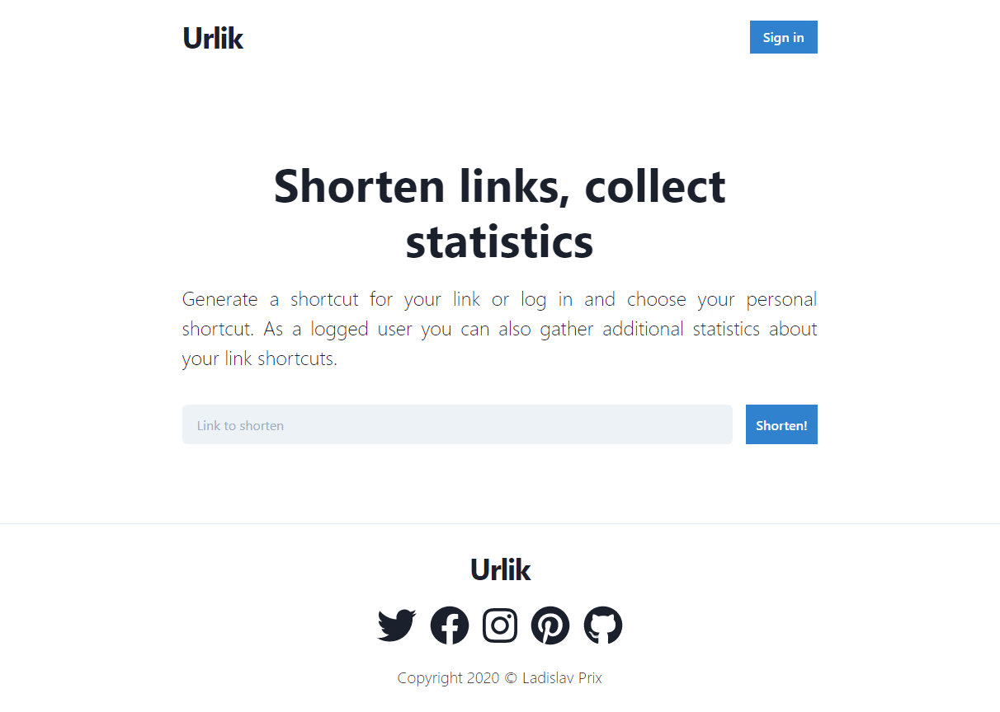

# Urlik 

Url shortener service with advanced statistics.

## Application Parts

The frontend can be found in [Urlik Next](https://github.com/prixladi/urlik-next) repository. 
The backend can be found in [Urlik Server](https://github.com/prixladi/urlik-server) repository. 
The worker can be found in [Urlik Worker](https://github.com/prixladi/urlik-worker) repository. 
Application is using [Shamyr Authority](https://github.com/prixladi/shamyr-cloud-authority) as an identity provider.

## Docker

### `docker-compose up`

Runs production-ready containers with the configuration specified in [/docker-compose.yml](docker-compose.yml).

## Images from app

